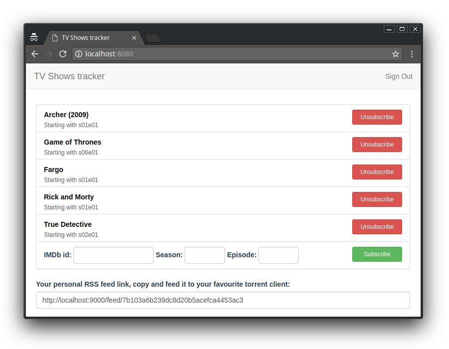

# TV Series Downloader
Keeps track of all your favourite TV shows and builds personal RSS feed with magnet links to all new episodes.

## Disclaimer
This service was created as a training project and only because there is no way to watch all my favourite TV shows properly (in english with subtitles, without god awful russian voice acting) legally.

## Structure

#### Backend
Built with Scala, using following libraries:
 - akka (actors and akka-http for routing) 
 - slick (database access)
 - spray-json (self-explanatory)

#### Database
 - PostgreSQL

#### Frontend
 - vue.js
